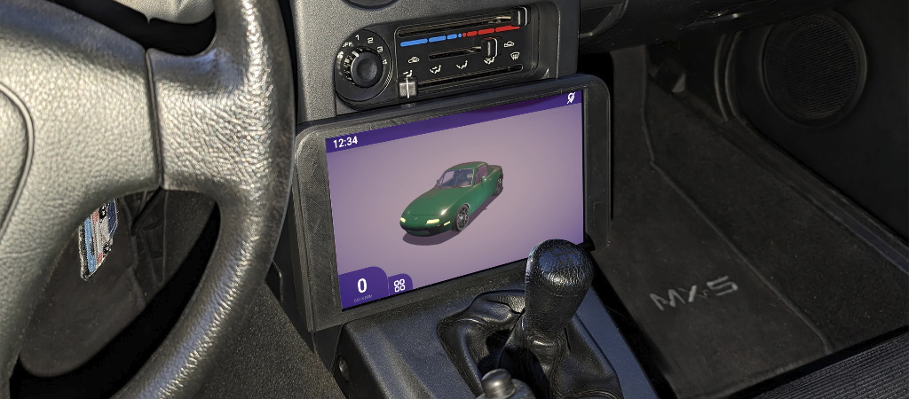

# SmartifyOS



>[!CAUTION]
>**Disclaimer:** This software is currently in the development phase and is intended for developers. It is not suitable for general use in vehicles yet.

The documentation can be found here: [docs.smartify-os.com](https://docs.smartify-os.com/)

And if you need any other help or want to talk about new features or changes you can join the [Discord](https://discord.gg/dYf8zrVUHt)

> [!WARNING]
> The documentation isn't fully done yet!


## About

### Short description:
SmartifyOS is a base application (source code) that makes it easy for you to create a custom GUI for a DIY infotainment system in older cars. It is based on the [Unity Game Engine](https://unity.com/), which means you have almost unlimited possibilities to customize it to your liking.

[More](https://smartify-os.com/about)

### This repo contains:
1. The SmartifyOS base application which is made so that it can be customized a lot and build on top of whatever you want
2. The full software for my Miata build on-top of the SmartifyOS base application

### Project structure:
All scripts you can use as a base to make your own system are in `Assets/SmartifyOS` all other folders in `Assets` (mainly `Scripts` and `ScriptableObjects`) are using the code from `Assets/SmartifyOS` as a base and are specific for my car and setup (like Arduinos and sensors).

I also tried to make everything in `Assets/SmartifyOS` so that you shouldn't need to modify anything in it to work with your specific setup since all the project specific code is in `Scripts` and `ScriptableObjects`.

Since SmartifyOS is still in the development phase there will probably be cases where you need to modify smoothing in `Assets/SmartifyOS`. Then just keep in mind that anything in there should not be (too) project (car/setup) specific.


## Supported Platforms
### Editor (Unity):

| Platform       | Supported  |
| -------------- | ---------- |
| Windows        | yes*       |
| Linux (Ubuntu) | yes        |
| macOS          | not tested |

<sub>*Some features like testing Bluetooth management and other things that rely on Linux don't work on a Windows systems</sub>


### Build:
| Platform          | Supported                    |
| ----------------- | ---------------------------- |
| Windows           | no                           |
| Linux Ubuntu x86  | yes                          |
| Linux Debian LXDE | yes                          |
| Linux Arm         | no (will hopefully be added) |
| Other Linux       | not tested                   |

## Installation (Editor)

You can also follow [this guide](https://smartify-os.com/setup) it will guide you through every step.

### For contribution:

If you want to contribute to this project by for example fixing a bug or adding a feature install it like this:

1. Install the [Unity Hub](https://unity.com/)  (When you open the Unity Hub the first time click on `Skip Installation`)
2. Go to the repository’s GitHub page and click the “Fork” button to create a copy of the repository in your own GitHub account.
3. Clone your new repo
   ```
   git clone https://github.com/your-username/SmartifyOS.git
   ```
4. Cd into its directory
   ```
   cd SmartifyOS
   ```
5. Add the Main Repository as a Remote 
   ```
   git remote add upstream https://github.com/Mauznemo/SmartifyOS.git
   ```
6. Open Unity Hub (Click on `Projects`), click `Add` > `Add Project from disk` and select the path of the repo you just cloned
7. Now click on the ⚠️ icon and install the needed version (make sure to tick `Linux Build support (Mono)` under `Add modules`)

### For only testing/using and finding bugs:
If you don't plan to modify any code and only want to help find bugs or suggest features to add you can do it like this:
1. Install the [Unity Hub](https://unity.com/) (When you open the Unity Hub the first time click on `Skip Installation`)
2. Clone the repo
   ```
   git clone https://github.com/Mauznemo/SmartifyOS.git
   ```
3. Open Unity Hub (Click on `Projects`), click `Add` > `Add Project from disk` and select the path of the repo you just cloned
4. Now click on the ⚠️ icon and install the needed version (make sure to tick `Linux Build support (Mono)` under `Add modules`)

## Contribution

First have a look at the **[Contribution guidelines for this project](CONTRIBUTING.md)**.

Then if you haven't already follow the steps here: [Installation For contribution (modifying code)](#for-contribution-modifying-code)

### Creating a pull request

1. Navigate to Your Forked Repository
2. Compare & Pull Request:
   - GitHub usually detects recent pushes and will show a prompt asking if you want to create a pull request. If this prompt appears, click on "Compare & pull request."
   - If the prompt does not appear, click the "Pull requests" tab, then click the "New pull request" button.
3. Select the Base and Compare Branches:
   - Base repository: This should be the original repository you forked from.
   - Base branch: Typically, this is the main or master branch of the original repository.
   - Head repository: This should be your forked repository.
   - Compare branch: Select the branch you just pushed.
4. Create Pull Request and make sure to follow the [Pull Request Guidelines](CONTRIBUTING.md#pull-request-guidelines)

## Related projects
**[SmartifyOS-Installer](https://github.com/Mauznemo/SmartifyOS-Installer)** - to auto install the build Unity app and all dependencies on the car's computer.

**[SmartifyOS-Documentation](https://github.com/Mauznemo/SmartifyOS-Documentation)** - documentation of all the SmartifyOS code and how to use it.

**[SmartifyOS-App](https://github.com/Mauznemo/SmartifyOS-App)** - android app to lock and unlock the car from your phone.

**[SmartMiata](https://github.com/Mauznemo/SmartMiata)** - all Arduino code I used for my Miata.

